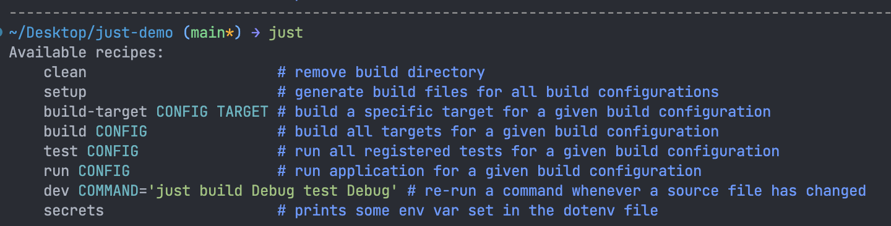
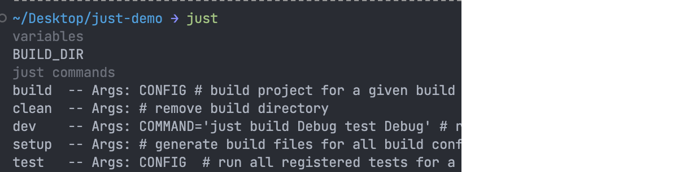

# Justfile demo

## Links

* [just](https://github.com/casey/just)
* [Installation](https://github.com/casey/just#installation)
* `dev` recipe uses [watchexec](https://watchexec.github.io)

Quick setup:

```bash
brew install just # Homebrew on macOS
choco install just # Chocolatey on Windows
cargo install just # you can use cargo if you have Rust installed
apk add just # alpine Linux, think small container ;)
```

## Usage in the demo project

```bash
# list all recipes, it also prints the last
# line of the comment above the recipe
$ just
# can chain recipes
$ just clean setup
# if a recipe has an argument,
# it needs to be supplied before,
# the next recipe in the chain
$ just build Debug test Debug
```

``` bash
# justfile can load root .env file,
# this recipe prints an env var
# that was set in the .env file
$ just secrets
```

## Demo

```just
build-target CONFIG TARGET:
    echo {{CONFIG}} {{TARGET}}

build CONFIG: (build-target CONFIG "all")
```

(these images are cropped...)

### listing recipes with docs



### auto-completion of all recipes



### auto-completion for a specific recipes


